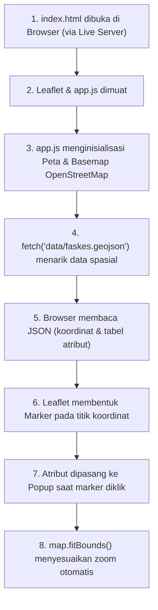

# WebGIS Praktikum SIG - Peta Interaktif Leaflet.js

Aplikasi WebGIS (Web Geographic Information System) sederhana dan ringan yang dibangun menggunakan **Vanilla HTML, CSS, JavaScript**, serta pustaka **Leaflet.js**. 

Proyek ini dirancang sebagai modul praktikum **Sistem Informasi Geografis (SIG)** agar mahasiswa/praktikan dapat memahami konsep dasar visualisasi data spasial (vektor titik/point) di web tanpa memerlukan framework yang rumit.

---

## 📁 Struktur Folder & Penjelasan File

```text
WebGIS_Peta_Desa_Leaflet/
├── 📄 index.html        # Kerangka utama website
├── 📄 README.md          # Dokumentasi proyek & panduan praktikum
├── 📁 css/
│   └── 📄 style.css     # Tata letak & styling peta layar penuh
├── 📁 js/
│   └── 📄 app.js        # Logika aplikasi Leaflet & pengambilan GeoJSON
├── 📁 data/
│   └── 📄 faskes.geojson# File data spasial GeoJSON (titik fasilitas/objek)
└── 📁 lib/
    └── 📁 leaflet/      # Pustaka offline Leaflet.js (CSS, JS, & Marker Images)
```

### Penjelasan Tiap File:
| File / Folder | Kegunaan |
| :--- | :--- |
| **`index.html`** | Pintu masuk aplikasi web. Berisi elemen `<div id="map"></div>` sebagai wadah peta, serta memuat file pustaka Leaflet dan file JavaScript logika (`app.js`). |
| **`css/style.css`** | Mengatur layout halaman agar peta Leaflet tampil responsif dan memenuhi seluruh layar monitor (`100vw` & `100vh`). |
| **`js/app.js`** | Mengatur seluruh logika peta: inisialisasi peta Leaflet, penambahan basemap OpenStreetMap, pengambilan data `faskes.geojson` via `fetch()`, pembuatan marker, isi jendela popup atribut, dan auto-zoom. |
| **`data/faskes.geojson`** | Tempat menaruh data spasial hasil ekspor dari software SIG (QGIS/ArcGIS). File ini sengaja dikosongkan untuk latihan praktikum mahasiswa. |
| **`lib/leaflet/`** | Berisi file pustaka Leaflet lokal (`leaflet.js`, `leaflet.css`, dan folder `images/`). Berfungsi agar peta dapat dijalankan secara mandiri tanpa harus tergantung pada koneksi CDN online. |

---

## 🔄 Alur Perjalanan Data (Data Flow)

Berikut adalah diagram alur bagaimana data spasial dibaca hingga tampil di layar:



### Tahapan Detail:
1. **Inisialisasi Peta**: `app.js` membuat objek peta pada `<div id="map">` dan memasang lapisan peta dasar (OpenStreetMap).
2. **Request Data**: Fungsi `fetch("data/faskes.geojson")` mengirim permintaan untuk mengambil file GeoJSON lokal.
3. **Konversi JSON**: Teks GeoJSON di-parse menjadi objek JavaScript yang berisi array `features`.
4. **Pemetaan Vektor**:
   - **Koordinat** (`geometry.coordinates`) diubah oleh `L.geoJSON` menjadi penanda lokasi (marker) biru Leaflet.
   - **Tabel Atribut** (`properties`) diurai untuk membentuk konten teks informasi pada popup marker.
5. **Auto-Zoom (`fitBounds`)**: Peta secara otomatis memperbesar (zoom) dan menggeser pusat tampilan agar seluruh sebaran titik dapat terlihat pas di layar monitor.

---

## 🚀 Cara Menjalankan Proyek (Panduan Praktikum)

Karena proyek ini menggunakan fungsi modern `fetch()` untuk membaca file GeoJSON, browser memerlukan **web server lokal** (untuk mematuhi aturan keamanan peramban / CORS):

1. **Buka Proyek di VS Code**:
   Buka folder `WebGIS_Peta_Desa_Leaflet` menggunakan Visual Studio Code.
2. **Install Ekstensi Live Server**:
   Jika belum memiliki, install ekstensi **Live Server** (oleh *Ritwick Dey*) dari menu Extensions (`Ctrl + Shift + X`).
3. **Jalankan Aplikasi**:
   - Buka file `index.html`.
   - Klik tombol **"Go Live"** di pojok kanan bawah VS Code, atau klik kanan pada `index.html` lalu pilih **Open with Live Server**.
   - Aplikasi akan otomatis terbuka di browser dengan alamat `http://127.0.0.1:5500`.

---

## 📝 Catatan Praktikum Mahasiswa

> **PENTING:**  
> File `data/faskes.geojson` sengaja dikosongkan. Untuk memunculkan titik pada peta:
> 1. Ekspor layer titik fasilitas (misal Rumah Sakit, SPBU, atau Sekolah) dari **QGIS / ArcGIS** dengan format **GeoJSON** (CRS: `EPSG:4326 - WGS 84`).
> 2. Salin atau simpan file tersebut ke dalam folder `data/` dengan nama `faskes.geojson`.
> 3. Simpan file, lalu refresh browser Anda. Titik-titik marker beserta informasi atributnya akan otomatis muncul di atas peta.
